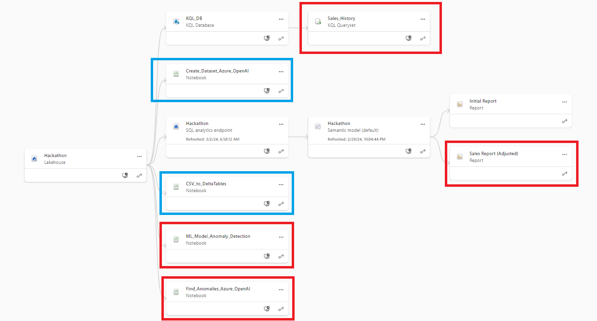
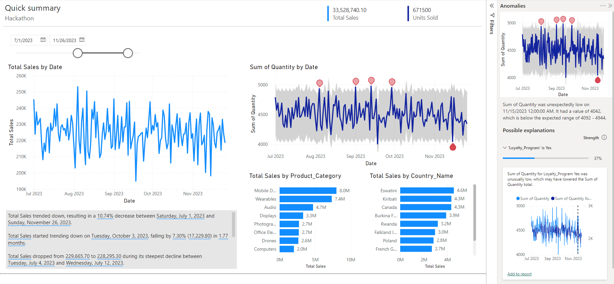

# Microsoft-Fabric-Hackathon
<!-- ABOUT THE PROJECT -->
## Leveraging distinct Microsoft Fabric and Copilot capabilities for Anomaly Detection, using a synthetic dataset created with Azure OpenAI

Project submitted for the "Hack Together: The Microsoft Fabric Global AI Hack" (https://github.com/microsoft/Hack-Together-Fabric-AI)

For more details about this submission, please refer to: https://example.com

## **Background**

### Details about Microsoft Fabric

*"Microsoft Fabric is an all-in-one analytics solution for enterprises that covers everything from data movement to data science, Real-Time Analytics, and business intelligence. It offers a comprehensive suite of services, including data lake, data engineering, and data integration, all in one place. With Fabric, you don't need to piece together different services from multiple vendors. Instead, you can enjoy a highly integrated, end-to-end, and easy-to-use product that is designed to simplify your analytics needs. The platform is built on a foundation of Software as a Service (SaaS), which takes simplicity and integration to a whole new level".* [^1]

[^1]: Source: https://learn.microsoft.com/en-us/fabric/get-started/microsoft-fabric-overview

### Project Description

This project leverages a variety of Microsoft Fabric components to tackle the challenges of anomaly detection for time series data. It addresses the topic from 4 different angles: 
- within PowerBI
- with KQL visuals
- running a specific model within Notebook
- creating a "low-code" model with the help of Azure OpenAI

Also, the data for this project was generated using Azure Open AI and to make it more realistic, it represents sales for a Global Retail Electronics Distributor. 

### Project Components

The description below shows the components used in the project.

`Workspace` `Lakehouse` `Notebooks` `AzureOpenAI` 
`SQL Analytics Endpoint` `Semantic Model` `PowerBI (and PBI Desktop)` `Copilot for PowerBI`
`KQL Database (using shortcuts)` `KQL Queryset`

The image below, from the Lineage view, summarizes how these components are being used together (the blue boxes were used to create the data and the red boxes are the different outputs).



This is how Azure OpenAI and Copilot were leveraged:
- **Azure OpenAI**:
	- Creating a base dataset (3 dimension tables and 1 fact table) based on some data specifications
	- Enhancing the base dataset and adapting it for a Global Retail Electronics Store
	- Creating a "low-code" anomaly detection model
- **Copilot**:
	- Auto-create Report Feature in PowerBI, to create a base report.
	- Using PowerBI Desktop, to adjust the .pbix and include AI features (Smart Narratives, also to use Anomaly Detection and the Explain By feature)

## **Development Process**
All scripts are included in the Scripts subfolder from this repository.

### 01 - Create Dataset leveraging AzureOpenAI and Data_Specs
- A synthetic dataset for Sales for a Global Retail Electronics company.
- This was created leveraging the Azure OpenAI API from Noteboook and data specifications files as shown here: [Create Dataset with AzureOpenAI](Scripts/Create_Dataset_Azure_OpenAI.ipynb)
- For the data specifications files, please refer to subfolder Data Specifications.
- As a result of this process, 4 csv files were created and saved to the Lakehouse, within a csv files subfolder.
	- Dim_Store
	- Dim_Customer
	- Dim_Product
	- Fact_Sales

### 02 - Load data from CSV files to delta tables
- This process creates delta tables from the csv files that were generated and stored in the lakehouse, in the previous step. 
- It takes care of cleaning the table names and column headers (no blank spaces, etc)
- Please refer to this link: [CSV to DeltaTables](Scripts/CSV_to_DeltaTables.ipynb)

### 03 - Build Semantic Model
- The model view of the semantic model is shown below: 
- It consists of the 4 delta tables, 2 measures (total sales and quantity sold) and a date view (created with a SQL query), which were added to the model using the SQL Endpoint. 

### 04 - Examine Anomalies in PowerBI
- Leveraging the Copilot AI capabilities in PowerBI, a Report was created using the Auto-create Report feature.
- The base .pbix report was then downloaded, enhanced with PowerBI Desktop and published to the workspace.
- 2 enhancements were done, which leverage the Copilot AI capabilities: including Anomaly detection and Smart Narratives

This picture shows the result:

[View the video](Recordings/PBI_Anomaly_Detection.webm)



### 05 - KQL Database and KQL Queryset
- A KQL Database was created.
- Data was added by leveraging the shortcuts feature to connect to the delta tables.
- After this, a KQL Queryset was created, using the anomaly detection in KQL.
- Below are the KQL query and the corresponding visual generated in the KQL Queryset

```js
let min_t = datetime(2023-01-01);
let max_t = datetime(2023-12-31);
let dt = 1d; // Daily aggregation
let loyalty_program = "Customers in loyalty program";
external_table("Fact_Sales_3")
| join kind=inner (
    external_table("Dim_Customer")
    | project Customer_ID, Loyalty_Program
) on Customer_ID
| where Date >= min_t and Date <= max_t
| where Loyalty_Program == "Yes"
| summarize sum(Quantity) by bin(Date, dt)
| make-series TotalQuantity=sum(sum_Quantity) on Date from min_t to max_t step dt
| extend (anomalies, score, baseline) = series_decompose_anomalies(TotalQuantity, 1.5, -1, 'linefit')
| project-away score
| render anomalychart with(anomalycolumns=anomalies, title=strcat('Daily Units Sold and Anomalies for ', loyalty_program));
```


### 06 - ML Model using Notebook
- An Isolation Forest algorithm was created to evaluate anomaly scores and detect anomalies.
- Please refer to this [link:](Scripts/Notebook_Anomaly_Detection.ipynb)
- Temporary Note: admittedly, this requires more refinement. It will be revised later in this repository.
- For more details about deploying an Isolation Forest algorithm for anomaly detection, please refer to: https://learn.microsoft.com/en-us/fabric/data-science/isolation-forest-multivariate-anomaly-detection

### 07 - Low-code ML Model using Notebook and Azure OpenAI
- This case is a low code alternative, which leverages Azure OpenAI for creating a ML algorithm for anomaly detection
- A prompt was made in Notebook to Azure OpenAI, to build the code for an Isolation Forest algorithm.
- The dataset and algorithm parameters were passed as part of the prompt
- Azure OpenAI then creates the script, which is executed in Notebook with the exec() function
- Please refer to this [link:](Scripts/Anomaly_Detection_using_Azure_OpenAI.ipynb)

<p align="right">(<a href="#readme-top">back to top</a>)</p>